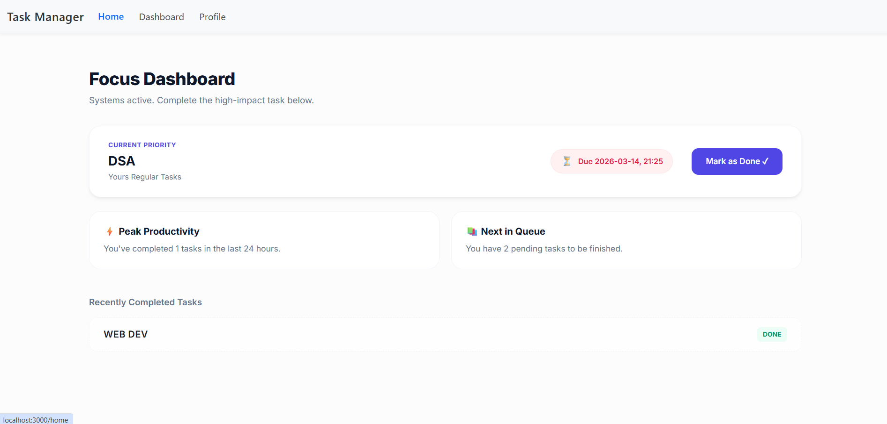
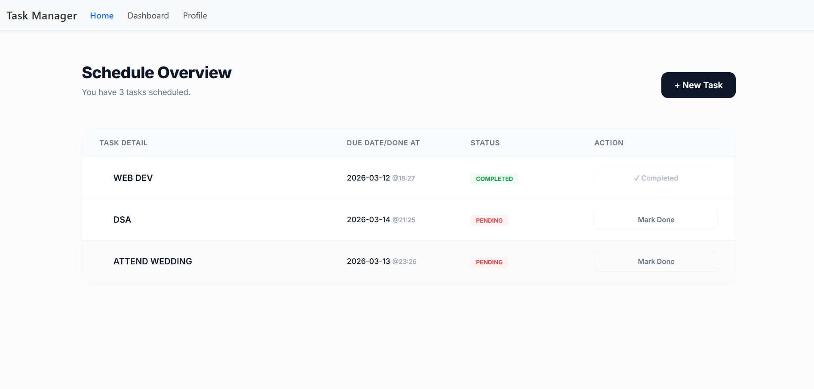
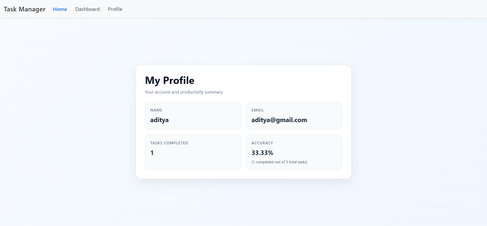

# Task Manager – MERN Productivity App

A task management web application built using the MERN stack.
The app focuses on smart task prioritization using data structures, helping users quickly identify the most important task.

---

## Overview

This project includes:

* A dashboard to create and manage tasks
* A home page that highlights the most important task
* A profile page with productivity analytics

The goal is to make task management simple and efficient.

---

## Features

### Navigation

* **Home** – Displays the highest priority task
* **Dashboard** – Create and manage tasks
* **Profile** – Shows user details and analytics

---

## Home Page

Shows the most important task using a priority algorithm.



---

## Dashboard (Task Management)

* Add tasks with title, description, and due date
* Set importance level (1–10)
* Real-time updates without refreshing the page



---

## Profile & Analytics

Stores user information and tracks productivity.



Accuracy formula:

```
Accuracy % = (Completed Tasks / Total Tasks) × 100
```

---

## Core Logic

The system calculates a priority weight for each task:

```
Priority Weight = (Importance × 0.7) + (Urgency Factor × 0.3)
```

This ensures tasks with higher importance and closer deadlines appear first.

---

## Tech Stack

Frontend

* React.js
* React Hooks
* Context API

Backend

* Node.js
* Express.js

Database

* MongoDB

---

A full-stack MERN project showing how data structures can improve productivity tools.
